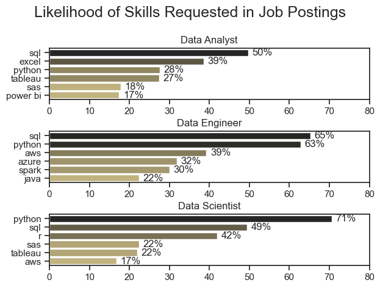
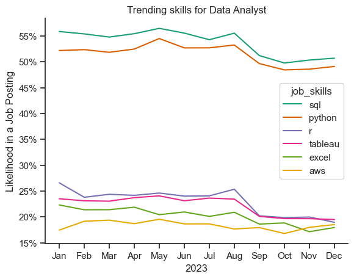
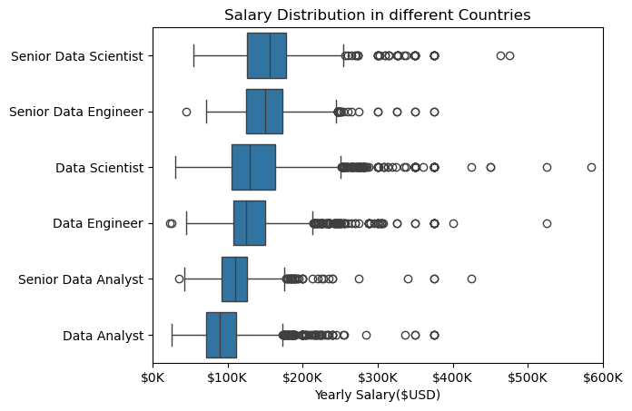
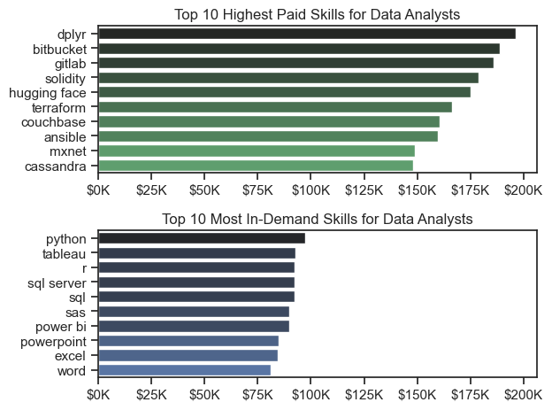
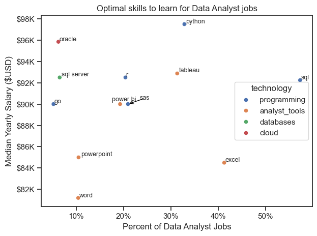

# Data Roles Job Market Analysis

A Python project analyzing Data jobs postings worldwide — including salary insights, job counts, top-paying roles, and geographic trends.

## Overview

This project collects, cleans, and analyzes job postings for Data Analyst, Business Analyst, Data Scientist, and similar roles from multiple countries.

It provides insights into:

* Salary distributions
* Highest‑paying and lowest‑paying roles
* Job demand by region
* Required skills and technologies
* Trends across industries

NOTE: All analysis is done using Python, Pandas, Matplotlib, and Seaborn.

## Table of Contents

* Folder 1 contains: Basic Python Commands.
* Folder 2 contains: Advanced Python Commands/Functions.
* Folder 3 contains: the Python project itself.

## Tools Used
- Python
- Matplotlib
- Pandas
- Seaborn

## Features

* Clean and preprocess raw job posting data
* Extract salary ranges and compute statistics.
* Identify top-paying job titles across different countries.
* Visualize salary distributions
* Compare job demand across different countries.
* Export results to CSV/Excel

## Previews:

### 1.- What are the most demanded skills for the top 3 data roles?

For the code, click on this link: [Skills_Count](3_Project/2_Skills_Count.ipynb)

### Results

### Insights

- Python is a skill with high demand (needed for a lot of job posts), we can see that based on the chart, it shows us that in these three Roles "Analyst" with 28%, "Engineer" with 63% and "Scientist" with 71%.
- SQL as alwys comes king with a miminum 49% of the jobs requiring this basic skill
- Also we can observe a significant rise in clodu technologies such as AWS, which have become very relevant in todays world.

### 2.- Trending skills for Data jobs and are will they more grow or appear less?

For the code click on this link [Skills_Trend](3_Project/3_Skills_Trend.ipynb)

### Results:

### Insights:

- SQL continues to dominate the data analytics landscape, holding above 50% demand throughout the entire year. Even at its lowest point, it still sits around 49%, making it the single most consistently required skill across job postings. This reinforces SQL as the baseline competency for anyone entering or advancing in data roles.
- Python tracks closely behind SQL, maintaining a high likelihood (around 50%+) of appearing in job postings across 2023. This aligns with its versatility across analytics, automation, machine learning, and data engineering.
The graph supports the idea that Python is no longer a “nice-to-have”—it’s a core requirement for modern data roles.
- AWS shows a noticeable upward trend over the year, reflecting the broader industry shift toward cloud‑native data stacks.
- Visualization tools (Tableau) and Excel remain steady but secondary
Tableau maintains moderate demand (roughly 20–25%), showing that while it's important, they’re not the primary differentiators in job postings.
- Excel remains a foundational tool, but the graph suggests employers prioritize programming and cloud skills over traditional spreadsheet work.

### 3.- Salary analysis for Data jobs.

For the code click on this link [Salary_Analysis](3_Project/4_Salary_analysis.ipynb)

### Results:

### Insights:

- What we can observe is, if you want to make the next jump from Data Analyst to a higher paying job, might as well skip "Senior Data Analyst"  and aim for "Data Engineer" or "Data Scientist", where you can earn more money.
- The median salary for Data Scientists appears higher than that of Data Engineers, and the Data Scientist box is more compact.
- Also that niche technologies are well paid but really scare in demand, so you are better off learning Python or SQL.

### 3.- What are the optimal skills to learn for Data jobs?

For the code click on this link [Optmal_Skills](3_Project/5_Optimal_Skills.ipynb)

### Results:

### Insights:

- Python and SQL clearly dominate the top-right quadrant:
    - SQL has the highest job demand by a wide margin.
    - Python has the highest median salary among all skills.

Together, they form the core skill set that maximizes both employability and earning potential.
- Niche technologies (Go, Oracle, SQL Server) pay well but have very limited demand.
    - You can earn more with niche tech
    - But the number of available roles is tiny
- Whilst Office 365 skills are necessary nowadays, they don't translate into high-paying jobs.
- Power BI is becoming a need-to-have for data roles.The pay is solid, but pairing it with Python and SQL significantly increases your chances of landing a top data job.